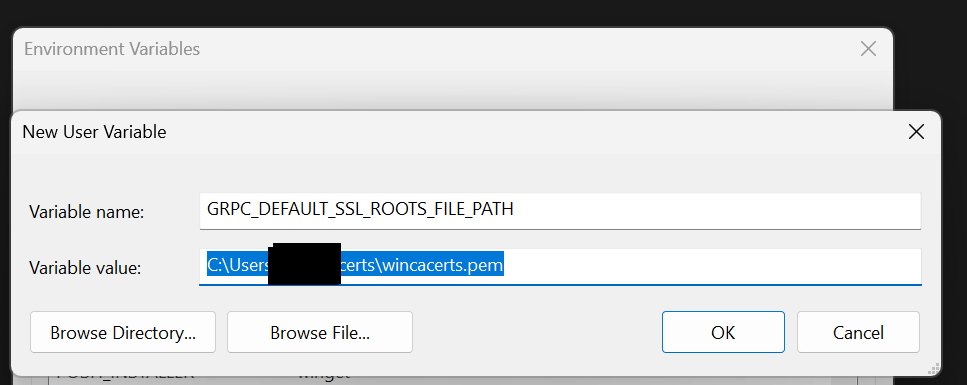

## Issue

If you are running Databricks-Connect locally on a Windows machine in a (company) network in which custom certificates (root & intermediary) are being used, you might run into the following (or a similar) error(s) when executing your code:

```text
Handshake failed with fatal error SSL ERROR SSL: SSL routines :OPENSSL internal:CERTIFICATE VERIFY FAILED.
```

Root cause is that Databricks-Connect is using [gRPC](https://grpc.io/), which does (in its current implementation) not know about any custom/company certificates, even if they are correctly rolled out to your local Windows cert-store.

The problem is very similar to the SSL issues you run into when using pip/requests or any other module that is using [certifi](https://pypi.org/project/certifi/). On the requests/certifi/pip topic you can find numerous posts online, for example [this one](https://stackoverflow.com/questions/51390968/python-ssl-certificate-verify-error#:~:text=34-,Update,-python%2Dcertifi%2Dwin32). The solution(s) usually involve installing [pip-system-certs](https://pypi.org/project/pip-system-certs/) or the (meanwhile deprecated) [python-certifi-win32](https://pypi.org/project/python-certifi-win32/). These fixes however do not solve your gRPC issues in Databricks-Connect.

## Solution

### 1. Create a `.pem` file containing company-specific certificates

Assuming you have all the relevant company-specific certificates rolled out to your local Windows cert-store[^1] you can use this little python script to extract them:

```python
import ssl

context = ssl.create_default_context()
der_certs = context.get_ca_certs(binary_form=True)
pem_certs = [ssl.DER_cert_to_PEM_cert(der) for der in der_certs]

with open('wincacerts.pem', 'w') as outfile:
    for pem in pem_certs:
        outfile.write(pem + '\n')
```

This will create a file (wincacerts.pem) with all the certificates that are currently residing in your Windows cert-store.

I suggest adding these certificates to the standard certificates that are shipped with [certifi](https://pypi.org/project/certifi)[^2]. To find those use:

```py
import certifi

print(certifi.where())

>>> 'd:\repos\XXX\.venv\lib\site-packages\certifi\cacert.pem'
```


Open the file found at the returned location plus the file we created before in any text editor and append the contents of `cacert.pem` into `wincacerts.pem` via simple copy/paste. The order of certificates within this file doesn't matter. Afterwards save and move `wincacerts.pem` to any location in your Windows user home. For example: `C:\Users\<username>\certs\wincacerts.pem`

### 2. Refer to custom certificates via environment variable(s)

Now we just need to tell `gRPC` where our custom certificate file is located. The easiest approach is to use the environment variable `GRPC_DEFAULT_SSL_ROOTS_FILE_PATH`. You can set that environment variable either in VS-Code (for a specific project/terminal) or - the method i prefer - in your user's Windows environment variables[^3]:

<br/>
_Hint: After setting new environment variables you need to restart all open terminals/shells to make the changes effective._

---
:tada: **And that's about it!** :tada:

Next time you run your Databricks-Connect code, the SSL handshake error should be gone.

[^1]: You can check your Windows cert-store via `Win+R -> certmgr.msc`.
[^2]: In case you are missing [certifi](https://pypi.org/project/certifi) in your Python environment, run `pip install certifi` first.
[^3]: You can set environment variables in Windows via `Win+R -> sysdm.cpl -> Advanced -> Environment Variables...`.
